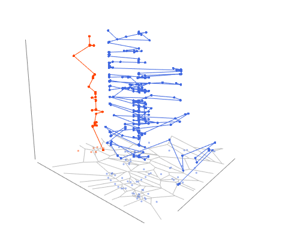

# movr 📊

[](https://cran.r-project.org/package=movr)
[](https://github.com/caesar0301/movr/actions)
[](https://opensource.org/licenses/Apache-2.0)
[](https://doi.org/10.1016/j.pmcj.2017.02.001)

**Analyzing and Visualizing Human Mobility Data in R**

`movr` is an R package that provides comprehensive tools for analyzing and visualizing spatio-temporal human mobility data. It originates from research on human mobility patterns and offers general transformation, calculation, and visualization utilities for mobility analysis.

## 🌟 Features

- **3D Trajectory Visualization**: Interactive 3D plots of mobility trajectories
- **Flow Maps**: Visualize population movements and migration patterns
- **Spatial Analysis**: Voronoi tessellation, spatial correlation, and coverage analysis
- **Temporal Analysis**: Time-of-day patterns, session generation, and temporal entropy
- **Statistical Tools**: Radius of gyration, entropy measures, and predictability analysis
- **Data Quality**: Comprehensive data quality assessment and validation tools

## 📦 Installation

### From CRAN (Recommended)
```r
install.packages("movr")
```

### From GitHub (Development Version)
```r
# Install devtools if you haven't already
if (!requireNamespace("devtools", quietly = TRUE)) {
  install.packages("devtools")
}

# Install movr from GitHub
devtools::install_github("caesar0301/movr")
```

### System Requirements
- **R** >= 3.0.0
- **GNU CMake** (for building C extensions)
- **GLib** development libraries

#### Ubuntu/Debian
```bash
sudo apt-get install cmake build-essential libglib2.0-dev
```

#### macOS
```bash
brew install cmake glib
```

#### Windows
Download and install [CMake](https://cmake.org/download/) manually.

## 🚀 Quick Start

```r
# Load the package
library(movr)

# Load example data
data(movement)

# Basic trajectory visualization
plot_traj3d(movement, x = "lon", y = "lat", z = "timestamp")

# Create a flow map
flowmap_data <- flowmap(movement, from = "origin", to = "destination")
plot_flowmap(flowmap_data)
```

## 📊 Usage Examples

### 3D Trajectory Visualization

Visualize individual or group mobility patterns in 3D space:

```r
# 3D trajectory plot
plot_traj3d(movement, 
            x = "lon", y = "lat", z = "timestamp",
            color_by = "user_id",
            alpha = 0.7)

# Voronoi tessellation in 3D
voronoi_result <- voronoi3d(movement, x = "lon", y = "lat", z = "timestamp")
```

### Flow Maps

Analyze population movements and migration patterns:

```r
# Create flow map from mobility data
flow_data <- flowmap(movement, 
                     from = "origin_cell", 
                     to = "destination_cell",
                     weight = "flow_count")

# Visualize with custom styling
plot_flowmap(flow_data,
             node_size = "population",
             edge_width = "flow_strength",
             color_scheme = "viridis")
```

### Spatial Analysis

```r
# Calculate radius of gyration
rog <- radius_of_gyration(movement, 
                         x = "lon", y = "lat", 
                         id = "user_id")

# Spatial correlation analysis
spatial_corr <- spatial.corr(movement, 
                            x = "lon", y = "lat",
                            time_window = "daily")
```

### Temporal Analysis

```r
# Time-of-day analysis
tod_data <- hour2tod(movement$timestamp)

# Generate mobility sessions
sessions <- gen_sessions(movement, 
                        id = "user_id",
                        time_threshold = 3600)  # 1 hour

# Calculate temporal entropy
temp_entropy <- entropy.spacetime(movement,
                                 id = "user_id",
                                 time_bins = 24)
```

### Data Quality Assessment

```r
# Comprehensive data quality check
dq_result <- dq.traj(movement,
                     id = "user_id",
                     time = "timestamp",
                     x = "lon", y = "lat")

# Point-level quality assessment
point_quality <- dq.point(movement,
                         x = "lon", y = "lat",
                         time = "timestamp")
```

## 📈 Visualization Gallery

### 3D Mobility Trajectories


### Flow Maps (Senegal D4D Challenge 2014)


### 3D Map Layers


## 📚 Documentation

- **Vignettes**: Comprehensive tutorials and examples
- **Function Reference**: Complete API documentation
- **Examples**: Code examples for common use cases

```r
# View package vignettes
vignette(package = "movr")

# Get help for specific functions
?plot_traj3d
?flowmap
?radius_of_gyration
```

## 🔬 Research Applications

`movr` has been used in various research applications, including:

- **Meta-Structure Discovery**: Analyzing city-scale cellular data patterns
- **Epidemic Modeling**: Understanding human mobility for disease spread prediction
- **Urban Planning**: Analyzing commuting patterns and city dynamics
- **Wireless Networks**: Optimizing network infrastructure based on mobility patterns

### Citation

If you use `movr` in your research, please cite:

```bibtex
@article{CHEN2017464,
  author = {Xiaming Chen and Haiyang Wang and Siwei Qiang and Yongkun Wang and Yaohui Jin},
  title = {Discovering and modeling meta-structures in human behavior from city-scale cellular data},
  journal = {Pervasive and Mobile Computing},
  volume = {40},
  pages = {464--476},
  year = {2017},
  doi = {https://doi.org/10.1016/j.pmcj.2017.02.001},
  url = {https://www.sciencedirect.com/science/article/pii/S1574119217300743}
}
```

## 🐛 Bug Reports & Support

- **GitHub Issues**: [Report bugs or request features](https://github.com/caesar0301/movr/issues)
- **Documentation**: [Package documentation](https://caesar0301.github.io/movr/)

## 📄 License

This project is licensed under the Apache License 2.0 - see the [LICENSE](LICENSE) file for details.

## 🙏 Acknowledgments

- **D4D Challenge**: Mobile data from Senegal provided by Orange
- **R Community**: For excellent tools and packages
- **Contributors**: All those who have contributed to this project

---

**Behavior informatics** studies the intrinsic laws of human and animal behavior in nature. Insights into individual or group mobility dynamics facilitate the development of enhanced simulation and prediction models in application fields like wireless communication networks, animal migration, and epidemic prediction. In common scenarios, individual mobility is described by three-element tuples: `<subjectId, timestamp, location>`, where location is represented by symbolic character names or geo-coordinates. `movr` originates from research on human mobility and provides general transformation, calculation, and visualization tools to facilitate work in this area.
