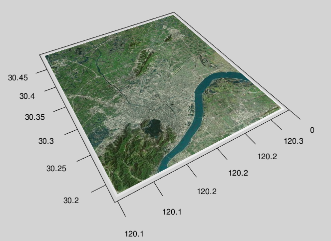

Examples and Tutorials
======================

This section provides detailed examples and tutorials for using `movr`.

3D Trajectory Visualization
---------------------------

Visualize individual or group mobility patterns in 3D space:

.. code-block:: r

   library(movr)
   data(movement)

   # 3D trajectory plot with color coding by user
   plot_traj3d(movement, 
               x = "lon", y = "lat", z = "timestamp",
               color_by = "user_id",
               alpha = 0.7,
               size = 2)

   # Voronoi tessellation in 3D
   voronoi_result <- voronoi3d(movement, 
                              x = "lon", y = "lat", z = "timestamp")

Flow Maps
---------

Analyze population movements and migration patterns:

.. code-block:: r

   # Create flow map from mobility data
   flow_data <- flowmap(movement, 
                        from = "origin_cell", 
                        to = "destination_cell",
                        weight = "flow_count")

   # Visualize with custom styling
   plot_flowmap(flow_data,
                node_size = "population",
                edge_width = "flow_strength",
                color_scheme = "viridis",
                alpha = 0.8)

   # Flow statistics
   flow_stats <- flow.stat(flow_data)

Spatial Analysis
---------------

Perform various spatial analyses:

.. code-block:: r

   # Calculate radius of gyration for each user
   rog <- radius_of_gyration(movement, 
                            x = "lon", y = "lat", 
                            id = "user_id")

   # Spatial correlation analysis
   spatial_corr <- spatial.corr(movement, 
                               x = "lon", y = "lat",
                               time_window = "daily")

   # Point coverage analysis
   coverage <- point.coverage(movement,
                             x = "lon", y = "lat",
                             radius = 1000)  # 1km radius

   # People occurrence analysis
   occurrence <- people.occurrence(movement,
                                  x = "lon", y = "lat",
                                  id = "user_id")

Temporal Analysis
----------------

Analyze temporal patterns in mobility data:

.. code-block:: r

   # Time-of-day analysis
   tod_data <- hour2tod(movement$timestamp)

   # Time-of-week analysis
   tow_data <- hour2tow(movement$timestamp)

   # Generate mobility sessions
   sessions <- gen_sessions(movement, 
                           id = "user_id",
                           time_threshold = 3600)  # 1 hour

   # Calculate temporal entropy
   temp_entropy <- entropy.spacetime(movement,
                                    id = "user_id",
                                    time_bins = 24)

   # Spatial entropy
   spatial_entropy <- entropy.space(movement,
                                   id = "user_id",
                                   x = "lon", y = "lat")

   # Random entropy
   random_entropy <- entropy.rand(movement,
                                 id = "user_id")

Statistical Analysis
-------------------

Perform statistical analyses on mobility patterns:

.. code-block:: r

   # Fit power law distribution
   power_law <- fit.power.law(movement$distance)

   # Fit truncated power law
   trunc_power_law <- fit.truncated.power.law(movement$distance)

   # Fit polyexponential distribution
   polyexp <- fit.polyexp(movement$distance)

   # Calculate RMSE
   rmse_value <- RMSE(predicted, observed)

Data Quality Assessment
----------------------

Assess and validate your mobility data:

.. code-block:: r

   # Comprehensive trajectory quality check
   dq_result <- dq.traj(movement,
                        id = "user_id",
                        time = "timestamp",
                        x = "lon", y = "lat")

   # Point-level quality assessment
   point_quality <- dq.point(movement,
                            x = "lon", y = "lat",
                            time = "timestamp")

   # Iovan distance quality check
   iovan_quality <- dq.iovan(movement,
                            x = "lon", y = "lat",
                            time = "timestamp")

Coordinate Transformations
-------------------------

Convert between different coordinate systems:

.. code-block:: r

   # Cartesian to geographic coordinates
   geo_coords <- cart2geo(x_cart, y_cart)

   # Geographic to Cartesian coordinates
   cart_coords <- geo2cart(lon, lat)

   # Radian conversions
   geo_rad <- cart2geo.radian(x_cart, y_cart)
   cart_rad <- geo2cart.radian(lon_rad, lat_rad)

   # Degree to radian conversion
   radians <- deg2rad(degrees)
   degrees <- rad2deg(radians)

Utility Functions
----------------

Use various utility functions:

.. code-block:: r

   # Calculate great circle distance
   distance <- gcd(lat1, lon1, lat2, lon2)

   # Euclidean distance
   euc_dist <- euc.dist(x1, y1, x2, y2)

   # Pairwise distances
   pairwise_dist <- pairwise.dist(coordinates)

   # Find midpoint
   mid_point <- midpoint(x1, y1, x2, y2)

   # Check if points are in area
   in_area_result <- in.area(points, area_polygon)

   # Rotate matrix 90 degrees
   rotated_matrix <- rot90(matrix_data)

   # Repeat each element
   repeated <- rep_each(vector, times)

Sequence Analysis
----------------

Analyze mobility sequences:

.. code-block:: r

   # Approximate sequence
   approx_seq <- seq_approximate(sequence, tolerance)

   # Collapse sequence
   collapsed_seq <- seq_collapsed(sequence)

   # Distinct sequence
   distinct_seq <- seq_distinct(sequence)

   # Sequence distance
   seq_distance <- seq_dist(seq1, seq2)

Visualization Gallery
--------------------

Here are some example visualizations you can create with `movr`:

3D Mobility Trajectories
~~~~~~~~~~~~~~~~~~~~~~~~

.. image:: ../../examples/mobility3d.png
   :alt: 3D Trajectories
   :align: center

Flow Maps
~~~~~~~~~

.. image:: ../../examples/flowmap.png
   :alt: Flow Maps
   :align: center

3D Map Layers
~~~~~~~~~~~~~

Advanced Examples
----------------

For more advanced examples and use cases, see the vignettes:

.. code-block:: r

   # View available vignettes
   vignette(package = "movr")

   # Open specific vignette
   vignette("vignette_name", package = "movr") 